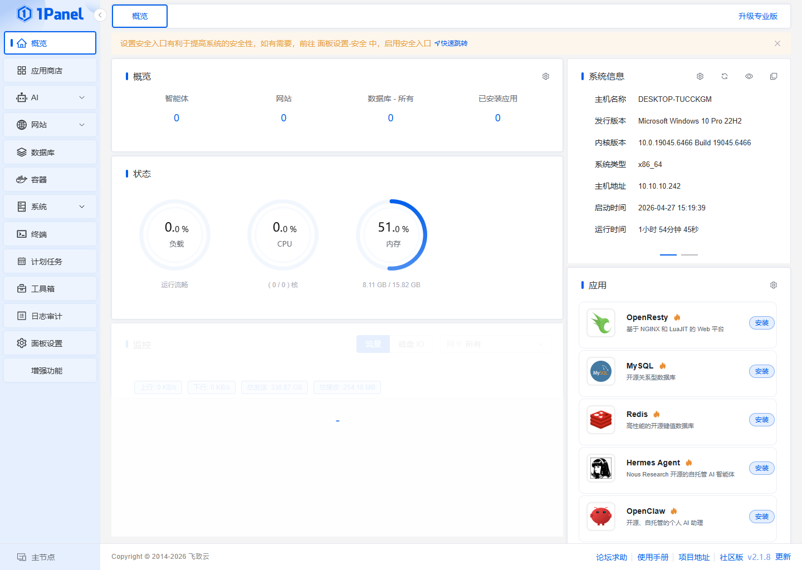
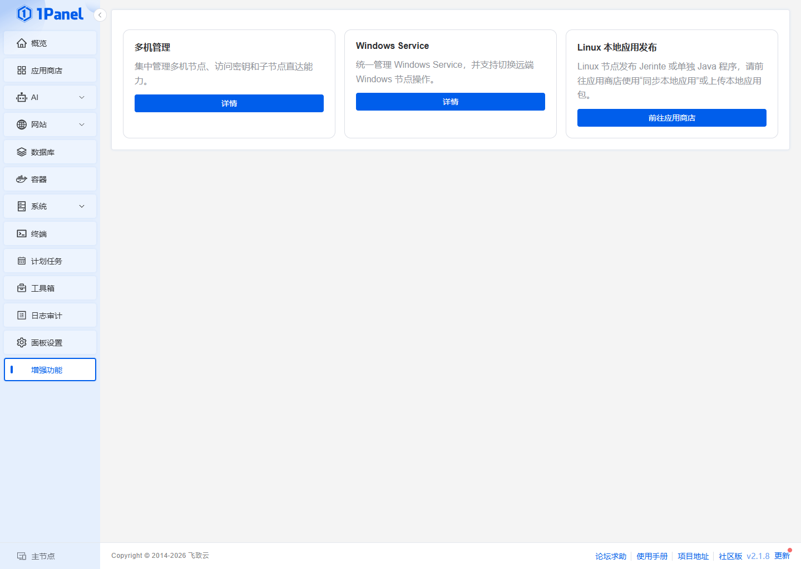
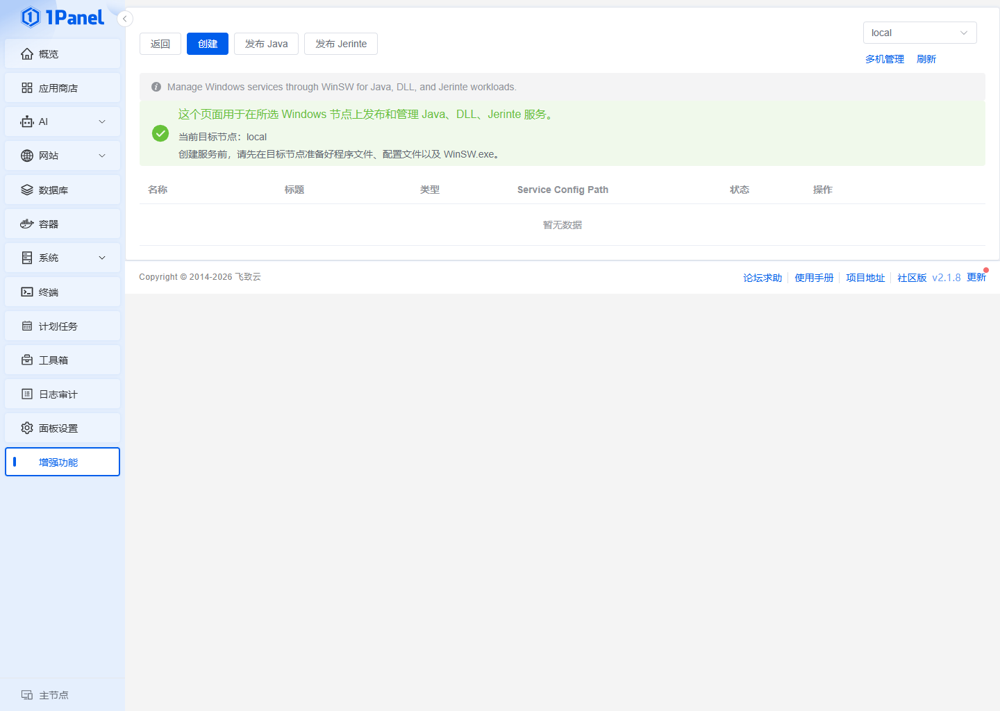
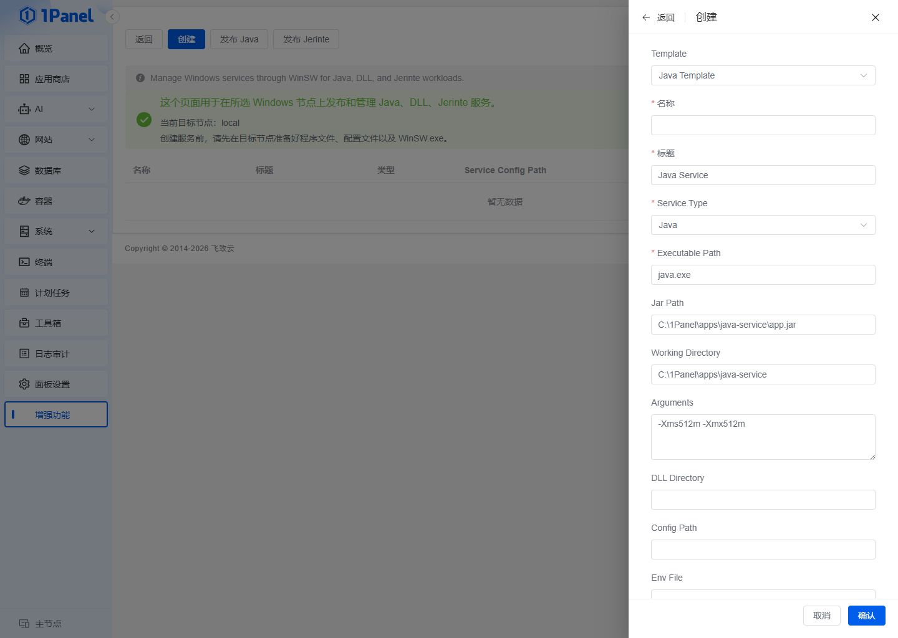

# Windows 上安装 1Panel 并发布 Java 程序操作文档

本文档用于指导在 Windows 机器上安装当前仓库版本的 `1Panel`，并通过页面把一个 Java 程序发布为 Windows 服务。

适用范围：

- 当前仓库版本：`v2.1.10`
- 当前 Windows 方案：`1Panel Windows Lite + Windows Service 发布能力`
- 推荐 Java 发布入口：`增强功能 -> Windows Service -> 发布 Java`

注意事项：

- 本文档基于当前仓库和当前 Windows 页面实际截图整理。
- Windows 侧发布 Java 程序，当前推荐走 `Windows Service` 路线，不走 Linux 的“应用商店本地应用包”路线。
- 默认账号密码仅用于首次进入面板，登录后请立即修改。

## 1. 环境准备

最终用户不需要安装 `Git`、`Go`、`Node.js`、`npm`，也不需要自行编译源码。

请先准备：

- Windows 管理员权限
- 当前发布的 `1panel-windows-v2.1.10.zip`
- 需要发布的 Java 程序包，通常是 `.jar`

推荐安装包内置：

- `tools\WinSW.exe`
- `runtime\zulu21.50.19-ca-jdk21.0.11-win_x64.zip`

如果安装包已经包含以上文件，用户不需要单独安装 JDK 或 WinSW。

推荐目录：

- 代码目录：`D:\work\1Panel`
- 1Panel 安装目录：`C:\1Panel`
- Java 程序工作目录：由 1Panel 根据服务名自动创建到安装目录下的 `service\<服务名>\app`

如果使用自带 JDK，安装脚本会解压到 1Panel 安装目录，创建服务时页面会自动使用该 JDK。

## 2. 安装 1Panel

准备好安装包后，先解压 `1panel-windows-v2.1.10.zip`。

推荐直接执行交互安装：

```powershell
.\install.cmd
```

如果需要手工指定安装参数，再使用：

```powershell
powershell -ExecutionPolicy Bypass -File ".\install.ps1" `
  -InstallDir "C:\1Panel" `
  -PanelVersion "v2.1.10" `
  -PanelPort "9999" `
  -PanelUsername "admin" `
  -PanelPassword "Admin123!"
```

安装完成后，默认会生成并安装：

- `C:\1Panel\bin\1panel-core.exe`
- `C:\1Panel\bin\1panel-agent.exe`
- `C:\1Panel\1panel\conf\app.yaml`
- `C:\1Panel\1panel\conf\1pctl.env`
- `C:\1Panel\service\1panel-core-service.xml`
- `C:\1Panel\service\1panel-agent-service.xml`

安装后的登录页示例：


## 3. 检查安装结果

### 3.1 检查服务状态

执行：

```powershell
Get-Service -Name "1panel-core-service","1panel-agent-service"
```

预期结果：

- `1panel-core-service` 为 `Running`
- `1panel-agent-service` 为 `Running`

### 3.2 检查配置文件

执行：

```powershell
Get-Content "C:\1Panel\1panel\conf\app.yaml"
```

当前默认关键信息如下：

- 面板地址：`http://127.0.0.1:9999`
- 默认账号：`admin`
- 默认密码：`admin123`
- 版本号：`v2.1.10`

### 3.3 浏览器打开面板

打开：

```text
http://127.0.0.1:9999/login
```

首次登录后请立即修改密码。

登录后的首页示例：



## 4. 进入 Java 发布入口

当前 Windows 侧发布 Java 程序，不是从 Linux 风格的“本地应用包”入口进入，而是从左侧菜单的 `增强功能` 进入。

路径：

```text
增强功能 -> Windows Service
```

增强功能页面示例：



进入 `Windows Service` 后，可以看到：

- `返回`
- `创建`
- `发布 Java`
- `发布交付包`

Windows Service 页面示例：



## 5. 准备 Java 程序目录

先把自己的 Java 程序准备好，例如：

```text
C:\1Panel\apps\demo-java
├─demo-java.jar
├─application-prod.yml
└─logs
```

建议：

- 程序目录使用单独目录，不要直接丢到桌面或下载目录。
- 如果程序需要外置配置，提前放到程序目录中。
- 如果程序依赖 DLL，把 DLL 单独放到一个 `dll` 子目录。

## 6. 页面创建 Java 服务

在 `增强功能 -> Windows Service` 页面中点击 `发布 Java`。

创建表单示例：



推荐填写方式如下：

### 6.1 基本字段

- `名称`：`demo-java`
- `标题`：`Demo Java Service`
- `类型`：`java`

说明：

- `名称` 用作服务目录名和服务标识，建议只用小写字母、数字、短横线。
- `标题` 是页面显示名，可以更友好一些。

### 6.2 Java 启动字段

- `上传程序包`：选择需要发布的 `.jar`
- `Args`：`-Xms512m -Xmx512m -Dfile.encoding=utf-8`
- `注册为 Windows 服务`：建议开启
- `开机自启`：按需要开启

说明：

- JDK 路径默认使用 1Panel 安装目录下的内置 JDK，不需要用户手工填写。
- JAR 路径不固定，也不要求文件名必须是 `app.jar`。上传后 1Panel 会把文件保存到 `service\<服务名>\app`，并自动得到真实 JAR 路径。
- `Args` 里不用手动写 `-jar xxx.jar`，当前服务脚本会自动拼接上传后的 JAR 路径。
- 如果你已经在 `Args` 里手工写了 `-jar`，那就保证和上传后的 JAR 路径一致，不要冲突。

### 6.3 可选字段

- `Config Path`：`C:\1Panel\apps\demo-java\application-prod.yml`
- `DLL Dir`：如果有 DLL 依赖再填，例如 `C:\1Panel\apps\demo-java\dll`
- `Env File Path`：通常留空，面板会自动生成
- `WinSW Path`：默认使用 1Panel 安装目录下的 `tools\WinSW.exe`
- `Auto Start`：建议开启

说明：

- `Config Path` 只是供服务模板记录配置文件位置，真正是否读取该配置，还取决于你的 Java 启动参数。
- 如果程序需要读外部配置，建议把参数补到 `Args` 中，例如：

```text
-Xms512m -Xmx512m -Dfile.encoding=utf-8 --spring.config.additional-location=C:\1Panel\apps\demo-java\application-prod.yml
```

## 7. 保存后会生成什么

点击保存后，面板会在以下目录生成服务包装文件：

```text
C:\1Panel\service\demo-java\
├─demo-java.xml
├─demo-java.cmd
├─demo-java.ps1
├─demo-java.env
└─demo-java.exe
```

其中：

- `.xml`：WinSW 服务定义
- `.cmd`：服务入口脚本
- `.ps1`：实际启动逻辑
- `.env`：环境变量文件
- `.exe`：从 `WinSW.exe` 复制出来的服务包装器

## 8. 启动与验证

创建完成后，回到列表页，执行以下操作：

1. 点击 `启动`
2. 等待状态刷新
3. 如有需要，再执行 `重启`

也可以用 PowerShell 检查：

```powershell
Get-Service -Name "demo-java"
```

如果程序本身带 HTTP 端口，再在浏览器打开你的业务地址，例如：

```text
http://127.0.0.1:8080
```

## 9. 日志位置

### 9.1 1Panel 自身日志

- `C:\1Panel\1panel\log\1Panel.log`
- `C:\1Panel\1panel\log\1Panel-Core.log`

### 9.2 WinSW 服务日志

Windows Service 相关日志目录：

```text
C:\1Panel\1panel\log\windows-services
```

以及：

- `C:\1Panel\1panel\log\1panel-core-service.out.log`
- `C:\1Panel\1panel\log\1panel-core-service.err.log`
- `C:\1Panel\1panel\log\1panel-agent-service.out.log`
- `C:\1Panel\1panel\log\1panel-agent-service.err.log`

如果 Java 服务启动失败，优先检查：

- `demo-java.ps1` 生成是否正确
- `Exec Path` 是否正确
- `Jar Path` 是否正确
- WinSW 生成的日志是否报找不到文件、找不到 JDK、找不到 DLL

## 10. 常见问题

### 10.1 面板打不开

检查：

- `1panel-core-service` 是否运行
- `9999` 端口是否被防火墙拦截
- 本机是否已经被其他程序占用了 `9999`

排查命令：

```powershell
Get-Service -Name "1panel-core-service"
netstat -ano | findstr 9999
```

### 10.2 登录时提示验证码错误

这通常是因为前面连续失败登录触发了验证码。

处理方式：

```powershell
Restart-Service -Name "1panel-core-service" -Force
```

然后重新打开登录页再试。

### 10.3 Java 服务保存成功，但启动失败

重点检查：

- `Exec Path` 是否是真实存在的 `java.exe`
- `Jar Path` 是否真实存在
- `Work Dir` 是否正确
- `WinSW Path` 是否存在
- `Args` 是否写了错误参数

### 10.4 程序依赖 DLL

如果 Java 程序依赖本地 DLL：

- 把 DLL 放到固定目录，例如 `C:\1Panel\apps\demo-java\dll`
- 在创建服务时填写 `DLL Dir`

当前服务脚本会把 `DLL_DIR` 注入到环境变量，并追加到 `PATH`。

## 11. 推荐操作顺序

建议按下面顺序执行：

1. 安装 JDK
2. 解压 `1panel-windows-v2.1.10.zip`
3. 执行 `install.cmd`
4. 打开面板并登录
5. 进入 `增强功能 -> Windows Service`
6. 点击 `发布 Java`
7. 填写 `java.exe`、`jar`、工作目录、参数
8. 保存后启动服务
9. 查看业务端口和日志

## 12. 交付建议

如果是交给运维或其他同事执行，建议一起提供以下内容：

- 本文档
- Java 程序目录压缩包
- `WinSW.exe`
- JDK 安装包
- 需要填写的业务参数清单

至少把这些参数单独写清楚：

```text
服务名称：
服务标题：
java.exe 路径：
jar 路径：
工作目录：
启动参数：
配置文件路径：
DLL 目录：
业务访问端口：
```

这样别人拿到后可以直接按文档安装，不需要再回头追问参数。 
