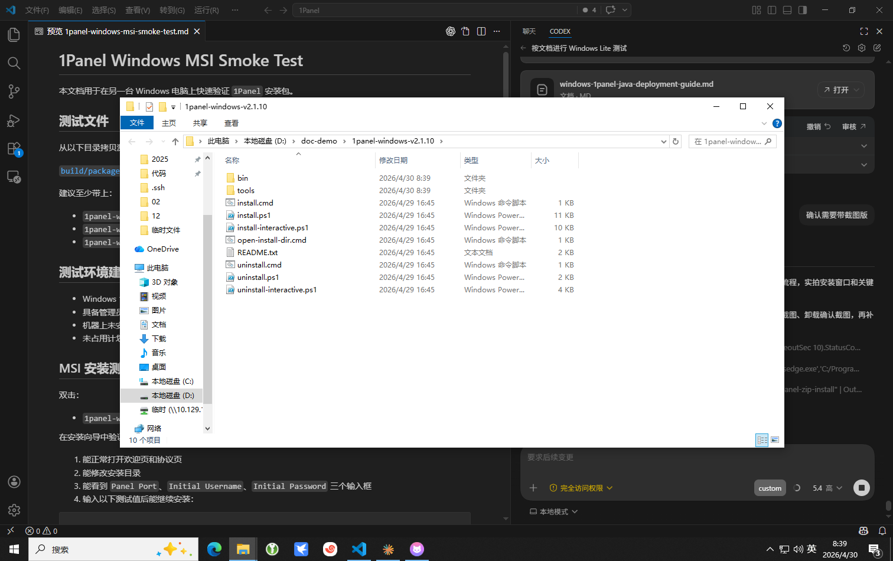
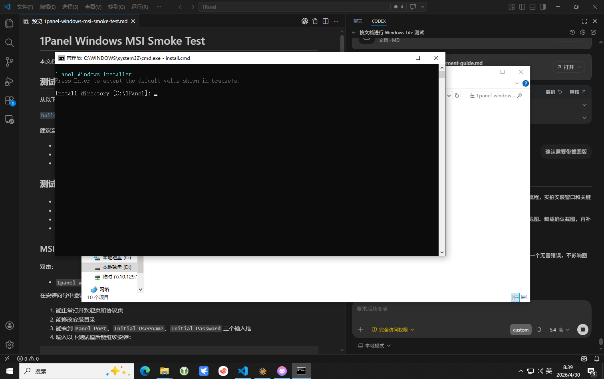
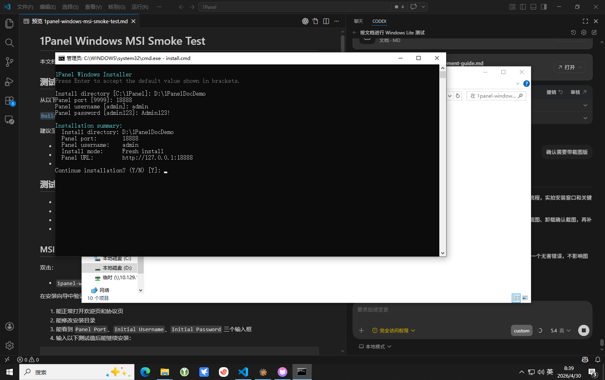
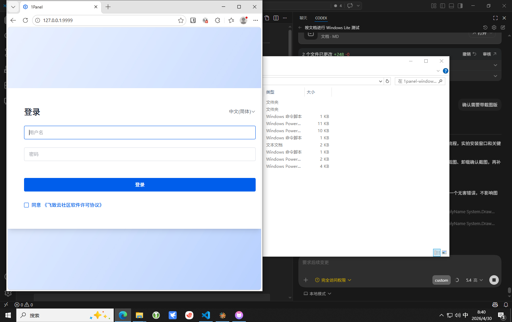
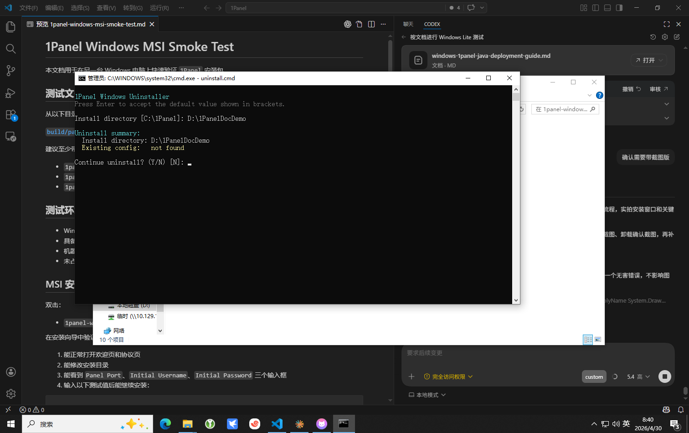

# Windows 版 1Panel ZIP 安装手册（带截图）

本文档面向最终使用人员，说明如何在 Windows 电脑上通过 `ZIP` 安装包安装、登录和卸载 `1Panel`。

当前推荐安装包：

- `1panel-windows-v2.1.10.zip`

纯文字版说明请参考：

- [windows-1panel-zip-install-guide.md](./windows-1panel-zip-install-guide.md)

## 1. 解压安装包

先把 `1panel-windows-v2.1.10.zip` 解压到任意目录。

解压后的目录示例：



截图中可以看到这些关键文件：

- `install.cmd`
- `install-interactive.ps1`
- `install.ps1`
- `uninstall.cmd`
- `uninstall-interactive.ps1`
- `uninstall.ps1`
- `open-install-dir.cmd`

## 2. 运行安装入口

双击：

- `install.cmd`

程序会自动申请管理员权限。  
如果系统弹出权限确认窗口，请选择“是”。

安装器启动后的界面示例：



## 3. 填写安装信息

安装器会依次询问：

1. 安装目录
2. 面板端口
3. 初始用户名
4. 初始密码

如果直接按回车，会使用默认值。

推荐填写示例：

```text
Install directory: C:\1Panel
Panel port: 9999
Panel username: admin
Panel password: Admin123!
```

截图中的演示值使用了测试目录和测试端口，仅用于展示：

- 安装目录：`D:\1PanelDocDemo`
- 端口：`18888`

## 4. 确认安装摘要

所有信息输入完成后，安装器会显示安装摘要。

安装摘要界面示例：



此时请重点检查：

- 安装目录是否正确
- 端口是否正确
- 用户名是否正确
- 页面显示的访问地址是否正确

确认无误后输入：

```text
Y
```

继续安装。

安装过程中，程序还会继续询问：

- 是否创建桌面快捷方式
- 是否安装完成后打开浏览器
- 是否打开安装目录

建议桌面快捷方式选择 `Y`。

## 5. 登录面板

安装完成后，可以直接在浏览器中访问：

```text
http://127.0.0.1:9999
```

如果安装时修改了端口，请使用实际端口访问。

登录页示例：



使用安装时填写的用户名和密码登录即可。

## 6. 安装完成后在哪里找文件

如果使用默认目录，安装位置通常是：

```text
C:\1Panel
```

常见目录：

- `C:\1Panel\bin`
- `C:\1Panel\1panel\conf`
- `C:\1Panel\service`
- `C:\1Panel\installer-logs`

如果忘记安装目录，可以：

1. 双击桌面的 `1Panel Install Directory`
2. 或运行 `open-install-dir.cmd`

## 7. 查看安装日志

交互安装器会把安装过程日志写入：

```text
<安装目录>\installer-logs\
```

例如：

```text
C:\1Panel\installer-logs\
```

如果安装失败，优先查看这里的 `install-*.log`。

## 8. 卸载 1Panel

推荐双击：

- `uninstall.cmd`

卸载确认界面示例：



卸载时会：

- 自动申请管理员权限
- 要求确认安装目录
- 停止并卸载 `1panel-core-service`
- 停止并卸载 `1panel-agent-service`
- 清理 1Panel 桌面快捷方式

## 9. 常见问题

### 1. 双击 `install.cmd` 没反应

请检查：

- 安装包是否已经完整解压
- 是否允许管理员授权弹窗出现
- 安全软件是否拦截了脚本

### 2. 浏览器打不开面板

请检查：

- 是否安装完成
- 访问端口是否正确
- 服务是否正常启动
- 端口是否被其他程序占用

### 3. 忘记安装目录

可通过以下方式查找：

- 桌面的 `1Panel Install Directory`
- 安装目录中的 `open-install-dir.cmd`
- 默认目录 `C:\1Panel`

## 10. 推荐交付内容

如果要把安装包交给其他同事或客户，建议同时交付：

1. `1panel-windows-v2.1.10.zip`
2. 本文档
